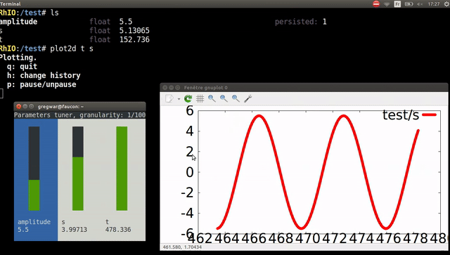

# Rhoban Input/Output Library

RhIO is a lightweight library that can be linked against your application
in order to interract with your program on-the-fly, through its integrated server.

Main feature are parameters that can be exposed in order to be changed, monitored
or persisted to configuration files. 

We also provide a shell client that will provide a bash-like interface to walk
your nodes and parameters, and even trigger methods that are in your code.

## How does it works ?

TODO

## Building

To build RhIO, you'll need cmake and a C++11 compliant compiler (gcc 4.8 or
above for instance).

    apt-get install cmake g++

Then, you'll first have to get and build ZeroMQ. To avoid compatibility reasons,
RhIO uses its own build of ZeroMQ, that will be done automatically with the 
following script:

    ./install-zmq.sh

You can now build the shell:

    cd Shell
    mkdir build
    cd build
    cmake ..
    make

And, for instance, the `Skeleton` demo:

    cd Skeleton
    mkdir build
    cd build
    cmake ..
    make

You can now run the skeleton project (in Skeleton/build):

    ./skeleton

And the rhio shell (in Shell/build):

    ./rhio

## Documentation

You can have a look at the following documentation:

* [Getting started](/Docs/get_started.md)
* [RhIO API](/Docs/api.md)
* [Using binding](/Docs/binding.md)
* [Shell commands and features](/Docs/shell.md)
